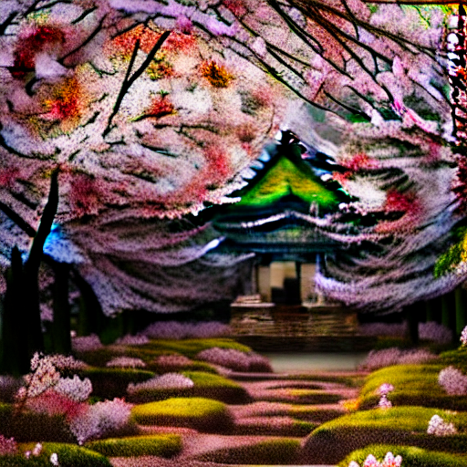

---

# Unified Sampler (UGD + PSLD) for Training-Free Style Transfer

This project implements a **training-free style transfer** pipeline on top of a Stable-Diffusion (LDM) model by **combining**:

* **UGD (Universal Guided Diffusion)** — forward guidance on (\hat z_0/\hat x_0) with optional **per-step self-recurrence** (denoise→re-noise cycles at the same (t)).
* **PSLD** — a measurement-consistency term adapted to style transfer (style = “measurement” computed with a differentiable **CLIP-Gram** descriptor).

> In our experiments we **do not** use UGD backward guidance (clean-space optimization). Forward guidance + self-recurrence + PSLD are used.

---

## Teaser

Generated with the unified sampler (prompt content + single style image):

| Venice (Starry-Night-like)             | Temple & Sakura    |
| -------------------------------------- | ----------------------------- |
|  |  |


---

## What’s inside

* **UGD forward guidance** on using a **CLIP-Gram** style operator
* **Self-recurrence** (k) micro-passes per outer timestep (t) (denoise→re-noise at same (t))
* **PSLD measurement consistency** (style loss acts as the “measurement”) with a log-SNR schedule (\omega_t)
* **Alternating schedule**: choose PSLD vs. UGD per timestep (`pattern`, `early_late`, or a custom schedule)

---

## Requirements

* Python 3.10+
* PyTorch (CUDA or MPS supported)
* The LDM/Stable-Diffusion codebase this project extends (PSLD-based fork)
* CLIP (for the style operator) and common vision deps (torchvision, PIL, etc.)

> Tip: install conda env `psld310` from the base repo, this project should run as-is.

---

## Quick start

The repo includes a convenience script:

```
run/unified_sampler_example.sh
```

### 1) Basic usage

```bash
bash run/unified_sampler_example.sh 
```

This launches the **UnifiedPSLDUGDSampler** and alternates between PSLD and UGD across timesteps with the chosen pattern. Outputs and intermediate previews go to `--outdir`.

### 2) “Early UGD, Late PSLD” recipe

```bash
bash run/unified_sampler_example.sh \
  --prompt "An ancient temple surrounded by cherry blossoms in morning mist" \
  --style_image /path/to/style.jpg \
  --ddim_steps 100 \
  --cfg 7.0 \
  --schedule_mode early_late \
  --split_timestep 30 \
  --psld_weight 0.7 \
  --ugd_weight 2.5 \
  --k_recur 2 \
  --seed 42 \
  --outdir outputs/temple_sakura
```

---

## Command-line flags (explained)

> Flag names reflect what the script typically forwards into `UnifiedPSLDUGDSampler.sample(...)` and your `GuidanceConfig` / `UnifiedConfig`. If a flag isn’t present in your script yet, you can add it or hard-code the default.

### Core generation

* `--prompt` (str): Text prompt (content).
* `--style_image` (path): Reference style image used by the **CLIP-Gram** style operator.
* `--steps` / `-S` (int): Number of DDIM steps (outer timesteps).
* `--eta` (float, default 0.0): DDIM stochasticity.
* `--cfg` (float): Classifier-free guidance scale for the UNet (prompt strength).
* `--seed` (int): RNG seed for reproducibility.
* `--outdir` (path): Output directory for images and logs.

### Unified scheduler (decides per-timestep method)

* `--schedule_mode` (`pattern`|`early_late`|`custom`): How to choose PSLD vs. UGD at each (t).
* `--pattern` (`even_odd`|`odd_even`): When `pattern` mode is used, alternate PSLD/UGD on even/odd indices.
* `--split_timestep` (int): When `early_late` mode is used, timesteps `>= split` use PSLD, earlier ones use UGD.
* `--psld_weight` (float): Multiplier on PSLD loss term (\omega_t \cdot \mathcal{L}_{style}) (after scheduling).
* `--ugd_weight` (float): Multiplier on the UGD inner-loop step size (stabilized in code).

### UGD guidance (forward; inner optimization on (x_t))

* `--step_wt` (float): Base step size for each inner update (scaled in code for stability).
* `--k_recur` (int): **Self-recurrence** count at a fixed outer (t) (denoise→re-noise cycles).
* `--normalize_grad` (bool): Normalize the guidance gradient per inner step (recommended).

### PSLD (style as measurement)

* `--omega` (float): Global weight for the style term; shaped into (\omega_t) via log-SNR schedule.
* `--gamma` (float): Extra coefficient for non-style tasks (e.g., inpainting glue); often 0 or small for pure style.
* `--inpainting` / `--mask` / `--operator`: For inverse-problem variants; for pure style, the operator is the **CLIP-Gram** extractor.
* `--apply_mid_frac` (e.g., `0.7`): (If present in your script) apply guidance only on the middle % of timesteps to avoid early/late instability.

---

## Output & logging

* Final image(s) in `--outdir`.
* Intermediate predictions (optionally) logged every few steps.
* If `tensorboard_logger` is available, the sampler logs:

  * sampling config, inner-loop losses, gradient norms, learning rates
  * per-timestep preview images under `generation_progress/`

---


## Citation & credits

This project builds on Stable Diffusion (LDM) and incorporates ideas from **UGD** and **PSLD**. The CLIP-Gram operator is a simple differentiable descriptor (Gram of CLIP patch tokens, off-diagonals) used for single-image style transfer.

---

**Have fun stylizing!** 
